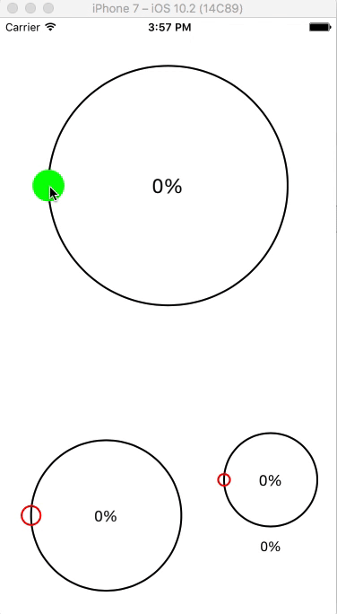

> **THIS PROJECT IS NO LONGER MAINTAINED. 
SOON WILL COME UP WITH SWIFTUI**

---

# KJCircularSlider

[](https://twitter.com/Kiranjasvanee)
[](https://github.com/KiranJasvanee/KJCircularSlider/blob/master/LICENSE)
[](https://github.com/KiranJasvanee/KJCircularSlider/issues)
[](https://github.com/KiranJasvanee/KJCircularSlider)
[](https://github.com/KiranJasvanee/KJCircularSlider)
[](https://github.com/KiranJasvanee/KJCircularSlider)

**NOTE: Pod version requires 1.2.0 & later**

## Preview
Slide your progress through circular!

  

## Example

To run the example project, clone the repo, and run `pod install` from the Example directory first.

## Requirements

- Swift 3.0.1 or later
- iOS 10.1 or later

## CocoaPods

KJCircularSlider is available through [CocoaPods](http://cocoapods.org). To install
it, simply add the following line to your Podfile:

```ruby
pod 'KJCircularSlider', '~> 0.2.0'
```

## Usage

KJCircularSlider can be used via code or interface builder. You can add two or more KJCircularSlider's in single view.

* If configuring via code, use the traditional init methods and properties.

* If using Interface Builder, add UIView on your interface builder, add KJCircularSlider in 'Class' & 'Module' properties of Identity inspector of added UIView.

Use following properties to edit design layout. Add your layout settings in `viewDidAppear`.

```swift 
// declare instance of KJCircularSlider by connecting to UIView outlet at interface builder
@IBOutlet weak var circularSliderLarge: KJCircularSlider!
```

```swift 
// use showPrecision boolean property to allow or not a precisions in percentage value.
circularSliderLarge.showPrecision = true

// use sliderWidth property value to apply width in circular
circularSliderLarge.sliderWidth = 2.0

// use sliderColor property value to apply color in circular
circularSliderLarge.sliderColor = UIColor.black

// use sliderSelectedAreaWidth property value to apply width in selected circular area
circularSliderLarge.sliderSelectedAreaWidth = 10.0

// use sliderSelectedAreaWidth property value to apply color in selected circular area
circularSliderLarge.sliderSelectedAreaColor = UIColor.orange

// use sliderCapColor property value to apply cap color
circularSliderLarge.sliderCapColor = UIColor.green

// use sliderCapColor boolean property value to weather fill or not a cap with cap color
circularSliderLarge.sliderCapFillColor = true

// use KJCircularDelegate, a delegate property to receive processed percentage value by using it's protocol method.
circularSliderLarge.KJCircularDelegate = self
``` 

Method

```swift
// use this protocol method to receive slider values
func getPercentage(circularSliderInstance: KJCircularSlider, percentValue: Float) {
        
        // use your declared instance for comparision, when you want use particular slider values at the time of two or more KJCircularSlider's available in single view.
        // access of specific small slider values
        if circularSliderInstance == circularSliderSmall {
            labelPercentForSmallerCircularSlider.text = "\(percentValue)%"
        }
    }
```

## Author

Kiran Jasvanee, kiran.jasvanee@yahoo.com, Skype: KiranJasvanee

## License

KJCircularSlider is available under the MIT license. See the LICENSE file for more info.
